# Level0

<details>

# 目次

<details><summary>目次詳細はこちら</summary>

- [Level0](#level0)
- [目次](#目次)
- [構築手順](#構築手順)
	- [プロジェクト作成](#プロジェクト作成)
	- [Home画面作成](#home画面作成)
- [アプリ機能の作成](#アプリ機能の作成)
	- [挨拶アプリ (GreetingApp)](#挨拶アプリ-greetingapp)
	- [色変化アプリ (ColorChangeApp)](#色変化アプリ-colorchangeapp)
	- [名前表示アプリ (NameDisplayApp)](#名前表示アプリ-namedisplayapp)
	- [数字表示アプリ (NumberDisplayApp)](#数字表示アプリ-numberdisplayapp)
	- [簡単な電卓 (SimpleCalculator)](#簡単な電卓-simplecalculator)
	- [日付表示アプリ (DateDisplayApp)](#日付表示アプリ-datedisplayapp)
	- [ボタンカウンター (ButtonCounterApp)](#ボタンカウンター-buttoncounterapp)
	- [8. シンプルメモ (SimpleMemoApp)](#8-シンプルメモ-simplememoapp)

</details>

# 構築手順

<details><summary>Level0アプリ一覧</summary>

| No | アプリ名(日本語) | 物理名 | 難易度(10段階) | 所要時間(日数) | 機能 | おすすめポイント | その他必要なものや特記事項 |
|---|---|---|---|---|---|---|---|
| 1 | [挨拶アプリ](#挨拶アプリ-greetingapp) | GreetingApp | 0 | 1h | ボタンを押すと挨拶を表示 | シンプルなUI操作を学べる | - |
| 2 | [色変化アプリ](#色変化アプリ-colorchangeapp) | ColorChangeApp | 0 | 1h | ボタンで背景色を変更 | 基本的なUI操作とイベント処理を学べる | - |
| 3 | [名前表示アプリ](#名前表示アプリ-namedisplayapp) | NameDisplayApp | 0 | 1h | 入力した名前を表示 | 入力と表示の基本を学べる | - |
| 4 | [数字表示アプリ](#数字表示アプリ-numberdisplayapp) | NumberDisplayApp | 0 | 1h | 数字を表示 | 画面に数値を表示する方法を学べる | - |
| 5 | [簡単な電卓](#簡単な電卓-simplecalculator) | SimpleCalculator | 0 | 1h | 1+1などの基本的な計算 | 基本的な計算機能を学べる | - |
| 6 | [日付表示アプリ](#日付表示アプリ-datedisplayapp) | DateDisplayApp | 0 | 1h | 現在の日付を表示 | 日付と時間の取得方法を学べる | - |
| 7 | [ボタンカウンター](#ボタンカウンター-buttoncounterapp) | ButtonCounterApp | 0 | 1h | ボタンを押すとカウントアップ | ボタンのイベント処理を学べる | - |
| 8 | [シンプルメモ](#シンプルメモ-simplememoapp) | SimpleMemoApp | 0 | 1h | メモを1つ保存 | 簡単な文字列の保存方法を学べる | UserDefaults利用 |
| 9 | [簡単なスライドショー](#簡単なスライドショー-simpleslideshowapp) | SimpleSlideshowApp | 0 | 1h | 画像をスライドショーで表示 | 画像表示とスライド機能を学べる | ローカル画像を使用 |
| 10 | [テキスト表示](#テキスト表示-textdisplayapp) | TextDisplayApp | 0 | 1h | 指定されたテキストを表示 | テキスト表示の基本を学べる | - |
| 11 | [数字足し算](#数字足し算-simpleadditionapp) | SimpleAdditionApp | 0 | 1h | 2つの数を足して表示 | 数学的処理の基本を学べる | - |
| 12 | [簡単なカウントダウン](#簡単なカウントダウン-simplecountdownapp) | SimpleCountdownApp | 0 | 1h | タイマーがカウントダウンする | タイマー機能の使い方を学べる | - |
| 13 | [ボタン色変更](#ボタン色変更-buttoncolorchangeapp) | ButtonColorChangeApp | 0 | 1h | ボタンの色を押すごとに変更 | UIの色変更を学べる | - |
| 14 | [ランダムな数字](#ランダムな数字-randomnumberapp) | RandomNumberApp | 0 | 1h | ランダムな数字を生成して表示 | ランダム処理の基礎を学べる | - |
| 15 | [簡単なメニュー](#簡単なメニュー-simplemenuapp) | SimpleMenuApp | 0 | 1h | メニューから選択肢を選ぶ | メニュー画面の作成方法を学べる | - |
| 16 | [入力フォーム](#入力フォーム-inputformapp) | InputFormApp | 0 | 1h | テキスト入力フォームを作成 | 入力フォーム作成とデータの取得方法を学べる | - |
| 17 | [画像表示](#画像表示-imagedisplayapp) | ImageDisplayApp | 0 | 1h | 画像を表示 | 画像の表示方法を学べる | ローカル画像を使用 |
| 18 | [タイトル変更](#タイトル変更-titlechangeapp) | TitleChangeApp | 0 | 1h | ボタンを押すとアプリのタイトルを変更 | アプリ名変更の基本を学べる | - |
| 19 | [数字減算](#数字減算-simplesubtractionapp) | SimpleSubtractionApp | 0 | 1h | 2つの数を引き算して表示 | 数学的処理の学習 | - |
| 20 | [時間表示](#時間表示-timedisplayapp) | TimeDisplayApp | 0 | 1h | 現在の時間を表示 | 時間の取得方法と表示を学べる | - |
| 21 | [クリック音](#クリック音-clicksoundapp) | ClickSoundApp | 0 | 1h | ボタンをクリックすると音が鳴る | 音の再生方法を学べる | AVFoundationの利用 |
| 22 | [単純な画像回転](#単純な画像回転-simpleimagerotationapp) | SimpleImageRotationApp | 0 | 1h | 画像を回転させる | 画像処理の基礎を学べる | - |
| 23 | [アイコン変更](#アイコン変更-iconchangeapp) | IconChangeApp | 0 | 1h | ボタンを押すとアイコンを変更 | アイコンの変更方法を学べる | - |
| 24 | [スクロールビュー](#スクロールビュー-scrollviewapp) | ScrollViewApp | 0 | 1h | 複数の画像をスクロールできるようにする | スクロール機能を学べる | - |
| 25 | [文字変更](#文字変更-textchangeapp) | TextChangeApp | 0 | 1h | ボタンを押すと画面の文字が変わる | 文字の変更方法を学べる | - |
| 26 | [ランダム色](#ランダム色-randomcolorapp) | RandomColorApp | 0 | 1h | ランダムに背景色を変える | ランダム処理とUIの連携を学べる | - |
| 27 | [ボタンカウント](#ボタンカウント-buttoncountapp) | ButtonCountApp | 0 | 1h | ボタンが押されるたびにカウントアップ | ボタン操作のカウントを学べる | - |
| 28 | [シンプルタイマー](#シンプルタイマー-simpletimerapp) | SimpleTimerApp | 0 | 1h | タイマーをセットして経過時間を表示 | タイマーの設定と管理方法を学べる | - |
| 29 | [数字反転アプリ](#数字反転アプリ-reversenumberapp) | ReverseNumberApp | 0 | 1h | 数字を反転して表示 | 文字列処理と数字操作を学べる | - |
| 30 | [色の名前表示](#色の名前表示-colornamedisplayapp) | ColorNameDisplayApp | 0 | 1h | 色の名前を入力してその色を表示 | 色の名前とカラーコードの関係を学べる | - |
| 31 | [複数ボタン](#複数ボタン-multiplebuttonapp) | MultipleButtonApp | 0 | 1h | 複数のボタンを表示し、それぞれ反応する | 複数ボタンの操作を学べる | - |
| 32 | [数字の順番](#数字の順番-numberorderapp) | NumberOrderApp | 0 | 1h | 数字を並べ替えるゲーム | 数字操作とアルゴリズムの基礎を学べる | - |
| 33 | [画像隠しゲーム](#画像隠しゲーム-hideimagegame) | HideImageGame | 0 | 1h | 画像をクリックして隠すゲーム | イベント処理と画像操作を学べる | - |
| 34 | [ボタン押下回数](#ボタン押下回数-buttonpresscountapp) | ButtonPressCountApp | 0 | 1h | ボタンを押した回数を表示 | ボタンのイベント処理を学べる | - |
| 35 | [音声録音](#音声録音-voicerecorderapp) | VoiceRecorderApp | 0 | 1h | 音声を録音し再生する | 音声録音機能を学べる | AVFoundation利用 |
| 36 | [タップ音](#タップ音-tapsoundapp) | TapSoundApp | 0 | 1h | 画面をタップすると音が鳴る | タップイベントと音再生を学べる | AVFoundation利用 |
| 37 | [画像反転](#画像反転-imageinvertapp) | ImageInvertApp | 0 | 1h | 画像を反転して表示 | 画像操作の基本を学べる | - |
| 38 | [文字スクロール](#文字スクロール-textscrollapp) | TextScrollApp | 0 | 1h | テキストをスクロールして表示 | スクロールの基本を学べる | - |
| 39 | [アイコン変更ゲーム](#アイコン変更ゲーム-iconchangegame) | IconChangeGame | 0 | 1h | アイコンが変わるゲーム | アイコンの変更とゲームロジックを学べる | - |
| 40 | [画像選択ゲーム](#画像選択ゲーム-imageselectgame) | ImageSelectGame | 0 | 1h | 画像をクリックして正解を選ぶゲーム | 画像選択とロジックを学べる | - |
| 41 | [シンプル掲示板](#シンプル掲示板-simpleboardapp) | SimpleBoardApp | 0 | 1h | 入力したテキストを一覧で表示 | テキスト保存と表示の基礎を学べる | UserDefaults利用 |
| 42 | [時計アプリ](#時計アプリ-clockapp) | ClockApp | 0 | 1h | 現在の時間を表示し更新する | 時計アプリの作成方法を学べる | - |
| 43 | [画像拡大アプリ](#画像拡大アプリ-imagezoomapp) | ImageZoomApp | 0 | 1h | 画像を拡大して表示 | 画像の拡大縮小を学べる | - |
| 44 | [画像並べ替え](#画像並べ替え-imagearrangeapp) | ImageArrangeApp | 0 | 1h | 画像を並べ替えるゲーム | 画像操作と並べ替えアルゴリズムを学べる | - |
| 45 | [シンプルカレンダー](#シンプルカレンダー-simplecalendarapp) | SimpleCalendarApp | 0 | 1h | 月表示のカレンダーを作成 | カレンダーUIの作成方法を学べる | - |
| 46 | [自動カウント](#自動カウント-autocounterapp) | AutoCounterApp | 0 | 1h | 自動でカウントアップする | 自動カウントとタイマー処理を学べる | - |
| 47 | [数字計算機](#数字計算機-simplecalcapp) | SimpleCalcApp | 0 | 1h | 基本的な計算機能を持つ | 数学的計算の基本を学べる | - |
| 48 | [メッセージ送信](#メッセージ送信-messagesendapp) | MessageSendApp | 0 | 1h | メッセージを送信するボタン | メッセージ送信機能を学べる | - |
| 49 | [動画再生](#動画再生-videoplayerapp) | VideoPlayerApp | 0 | 1h | 動画を再生する機能 | 動画再生機能を学べる | AVKit利用 |
| 50 | [簡単なスライダー](#簡単なスライダー-simplesliderapp) | SimpleSliderApp | 0 | 1h | スライダーで数値を調整 | スライダーと数値の操作を学べる | - |

</details>

## プロジェクト作成

<details>

1. Xcode起動
2. Create New Project...
   1. 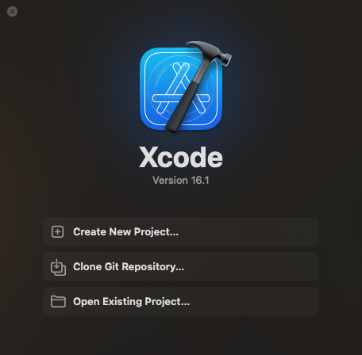
3. ios→App
   1. 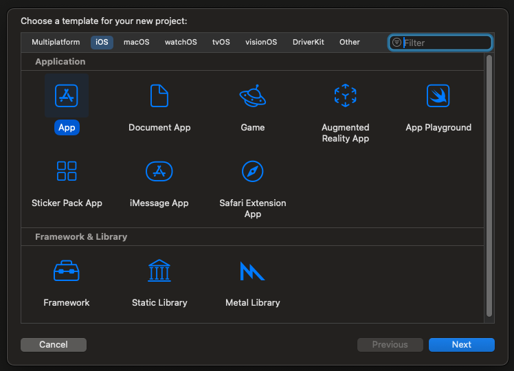
4. Level0
   1. 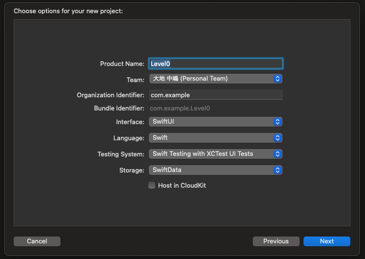
5. ディレクトリ(適当)
   1. 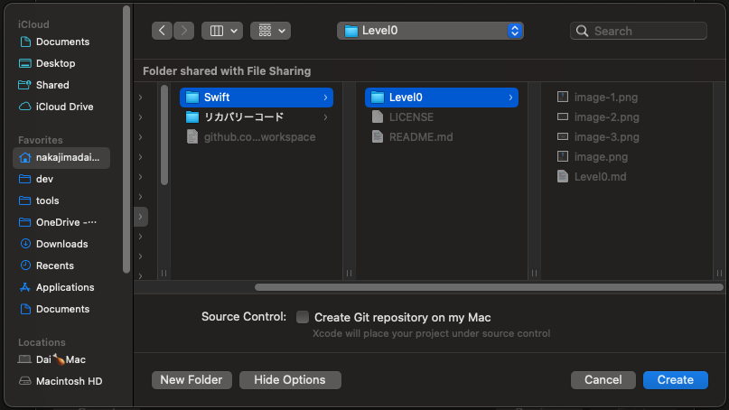
6. Level0App.swiftの修正
   1. ContentView()のコメントアウト
   2. HomeView()に変更
   3. 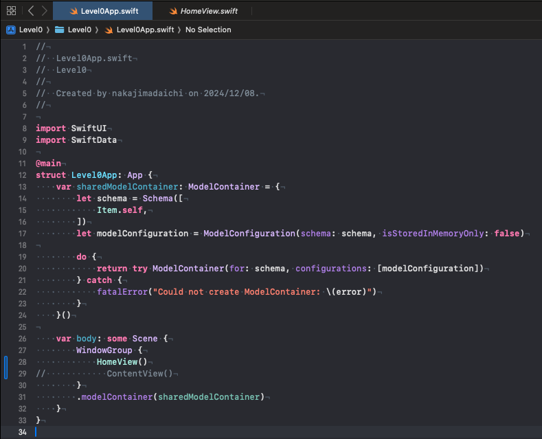
7. HomeView.swiftの作成
   1. 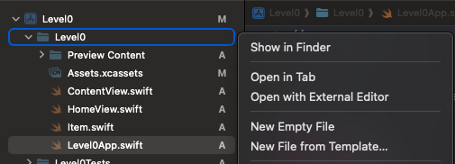
   2. 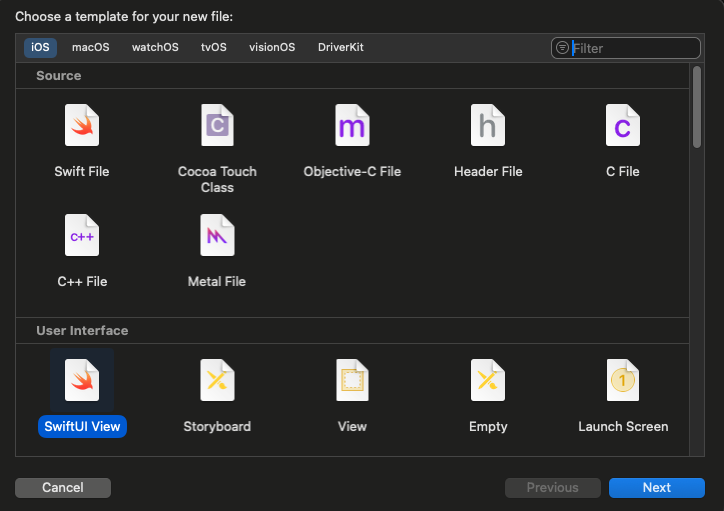
   3. 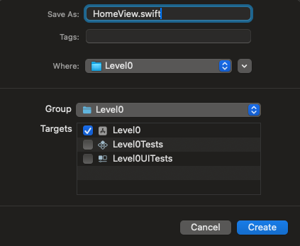
8. 確認と表示
   1. 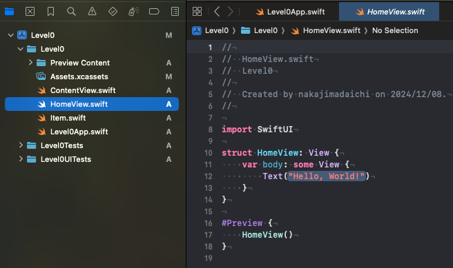

## Home画面作成
1. NavigationViewを使用
2. HomeView.swiftの実装
   ```swift
   struct HomeView: View {
       var body: some View {
           NavigationView {
               // 1. 挨拶アプリ (GreetingApp)
               NavigationLink("挨拶アプリ") {
                   GreetingApp()
               }
           }
       }
   }
   ```
   1. GreetingApp.swiftが無いのでエラーになる
   2. 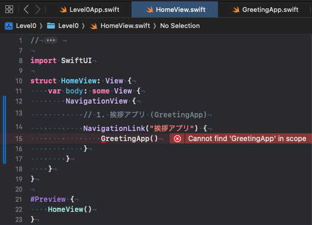

</details>

# アプリ機能の作成

## 挨拶アプリ (GreetingApp)

<details>

| No | アプリ名(日本語) | 物理名 | 難易度(10段階) | 所要時間(日数) | 機能 | おすすめポイント | その他必要なものや特記事項 |
|---|---|---|---|---|---|---|---|
| 1 | 挨拶アプリ | GreetingApp | 0 | 1h | ボタンを押すと挨拶を表示 | シンプルなUI操作を学べる | - |

1. GreetingApp.swiftの作成
   1. 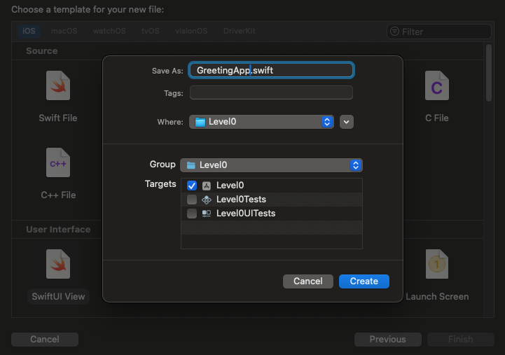
2. GreetingApp.swiftの実装
   ```swift
    struct GreetingApp: View {
       @State private var greeting = "こんにちは！"
       
       var body: some View {
           VStack {
               Text(greeting)
                   .font(.largeTitle)
                   .padding()
               
               Button(action: {
                   greeting = "おはようございます！"
               }) {
                   Text("挨拶を変更")
                       .font(.title)
                       .padding()
                       .background(Color.blue)
                       .foregroundColor(.white)
                       .cornerRadius(10)
               }
           }
       }
   }
   ```
3. CanvasでHomeView⇄GreetingApp間の画面遷移と挨拶変更ボタン
   1. これだと一回しか変えれないな...
   2. 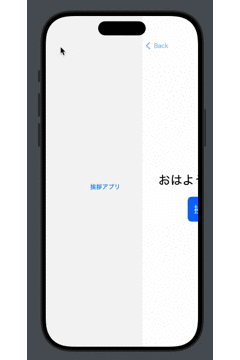
4. onとoffnのスイッチを使って切替に実装変更
   ```swift
   struct GreetingApp: View {
       @State private var isOn = false
       
       var body: some View {
           VStack {
               Text(isOn ? "おはようございます！" : "こんにちは！")
                   .font(.largeTitle)
                   .padding()
               
               Button(action: {
                   isOn.toggle()
               }) {
                   Text("挨拶を変更")
                       .font(.title)
                       .padding()
                       .background(Color.blue)
                       .foregroundColor(.white)
                       .cornerRadius(10)
               }
           }
       }
   }
   ```
5. 画面遷移と挨拶変更ボタン
   1. 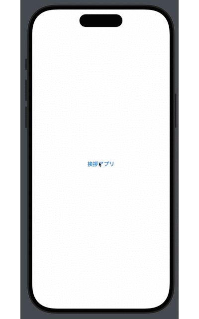
6. 挨拶アプリ (GreetingApp) 作成完了

</details>

## 色変化アプリ (ColorChangeApp)

<details>

| No | アプリ名(日本語) | 物理名 | 難易度(10段階) | 所要時間(日数) | 機能 | おすすめポイント | その他必要なものや特記事項 |
|---|---|---|---|---|---|---|---|
| 2 | 色変化アプリ | ColorChangeApp | 0 | 1h | ボタンで背景色を変更 | 基本的なUI操作とイベント処理を学べる | - |

1. ColorChangeApp.swiftの作成
   1. 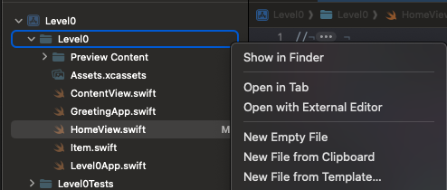
   2. 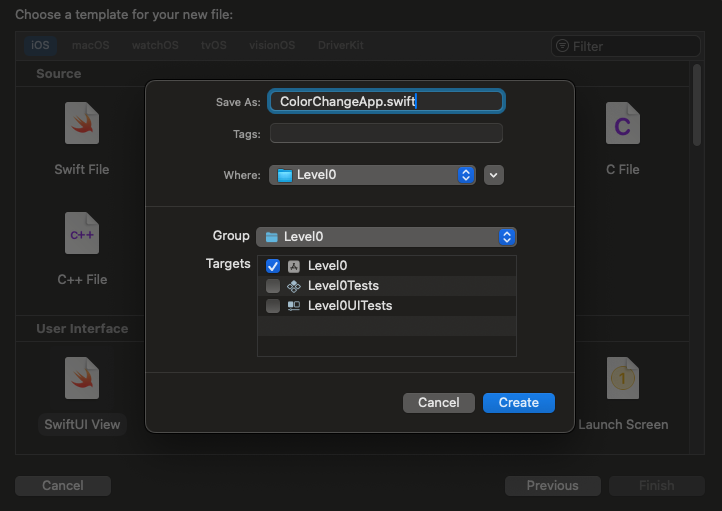
2. ColorChangeApp.swiftの実装
   ```swift
   struct ColorChangeApp: View {
       @State private var color: Color = .red
       
       var body: some View {
           VStack {
               Rectangle()
                   .fill(color)
                   .frame(height: 200)
                   .padding()
               
               Button(action: {
                   color = color == .red ? .blue : .red
               }) {
                   Text("背景色を変更")
                       .font(.title)
                       .padding()
                       .background( color == .red ? Color.blue : .red)
                       .foregroundColor(.white)
                       .cornerRadius(10)
               }
           }
           .navigationTitle("色変化アプリ")
       }
   }
   ```
3. 背景色変更ボタン
   1. ちゃんとボタンの色変化しててイイね！
   2. 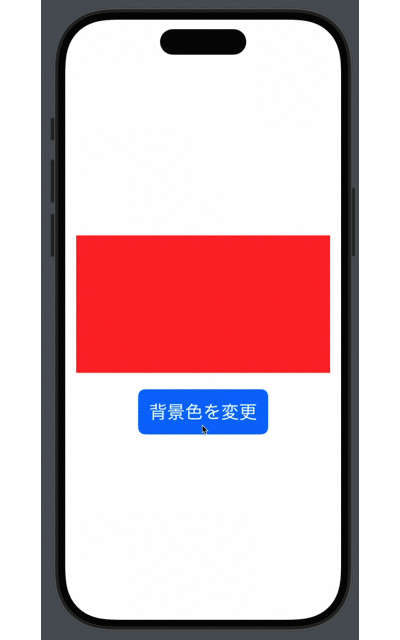
4. HomeView.swiftの実装
   1. iOS16からSwiftUIのNavigationViewが非推奨になるため、NavigationViewからNavigationStackへの移行しました。
   ```swift
   import SwiftUI
   
   struct HomeView: View {
       let apps: [AppInfo] = [
           AppInfo(title: "挨拶アプリ", destination: AnyView(GreetingApp())),
           AppInfo(title: "色変化アプリ", destination: AnyView(ColorChangeApp())),
       ]
   
       var body: some View {
           NavigationStack {
               List(apps) { app in
                   NavigationLink(destination: app.destination) {
                       HStack {
                           Text("\(apps.firstIndex(where: { $0.id == app.id })! + 1)")
                           Text(app.title)
                       }
                   }
               }
               .navigationTitle("アプリ一覧")
           }
       }
   }
   
   struct AppInfo: Identifiable {
       let id = UUID()
       let title: String
       let destination: AnyView
   }
   
   #Preview {
       HomeView()
   }
   ```
5. HomeViewの状態
   1. 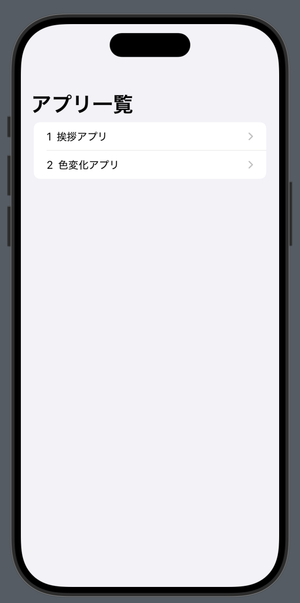
6. ColorChangeAppの状態
   1. 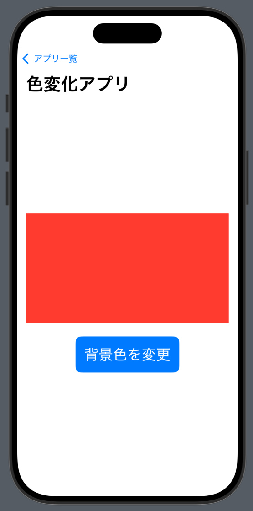
7. ScrollViewの追加
   1. HomeView.swift
   ```swift
   ScrollView {
       HStack {
           Text("\(apps.firstIndex(where: { $0.id == app.id })! + 1)")
           Text(app.title)
       }
   }
   ```
8. スクロール表示
   1. お！！タイトルが自動で上に行く！
   2. 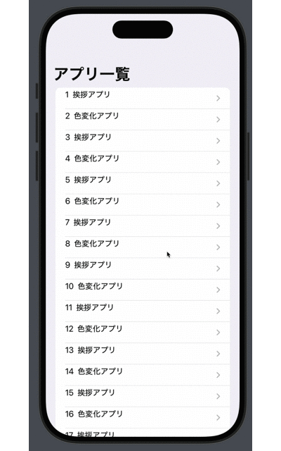
9.  色変化アプリ (ColorChangeApp) 作成完了

</details>

</details>

## 名前表示アプリ (NameDisplayApp)

<details>

| No | アプリ名(日本語) | 物理名 | 難易度(10段階) | 所要時間(日数) | 機能 | おすすめポイント | その他必要なものや特記事項 |
|---|---|---|---|---|---|---|---|
| 3 | 名前表示アプリ | NameDisplayApp | 0 | 1h | 入力した名前を表示 | 入力と表示の基本を学べる | - |

1. NameDisplayApp.swiftの作成と実装
   ```swift
   import SwiftUI
   
   struct NameDisplayApp: View {
       @State private var name = ""
       
       var body: some View {
           VStack {
               Text("名前")
                   .padding(.leading)
                   .frame(maxWidth: .infinity, alignment: .leading)
               
               TextField("名前を入力", text: $name )
                   .padding()
                   .textFieldStyle(RoundedBorderTextFieldStyle())
               
               Text("こんにちは、 \n\(name)さん!")
                   .font(.title)
                   .padding()
           }
           .padding()
           .navigationTitle("名前表示アプリ")
       }
   }
   
   #Preview {
       NameDisplayApp()
   }
   ```
2. HomeView.swiftの実装
   1. AppInfo構造体のインスタンスを作成します。
   2. `AppInfo(title: "名前表示アプリ", destination: AnyView(NameDisplayApp())),`
3. 動作確認
   1. 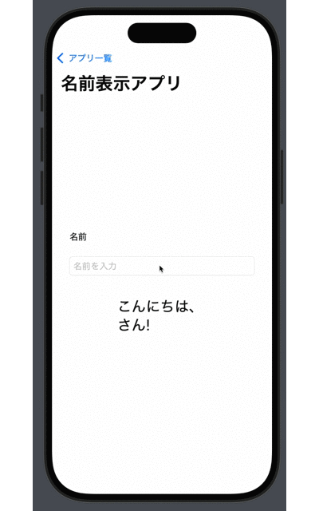
4. 名前表示アプリ (NameDisplayApp) 作成完了

</details>

## 数字表示アプリ (NumberDisplayApp)

<!-- <details> -->

| No | アプリ名(日本語) | 物理名 | 難易度(10段階) | 所要時間(日数) | 機能 | おすすめポイント | その他必要なものや特記事項 |
|---|---|---|---|---|---|---|---|
| 4 | 数字表示アプリ | NumberDisplayApp | 0 | 1h | 数字を表示 | 画面に数値を表示する方法を学べる | - |

1. NumberDisplayApp.swiftの作成と実装
   ```swift

   ```
2. HomeView.swiftの実装
   1. AppInfo構造体のインスタンスを作成します。
   2. `AppInfo(title: "数字表示アプリ", destination: AnyView(NumberDisplayApp())),`
3. 動作確認
   1. 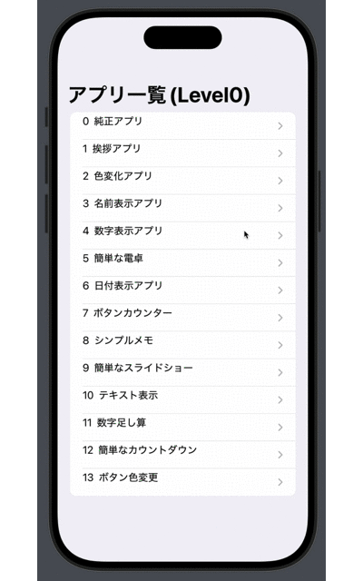
4. 数字表示アプリ (NumberDisplayApp) 作成完了

</details>

## 簡単な電卓 (SimpleCalculator)

<details>

| No | アプリ名(日本語) | 物理名 | 難易度(10段階) | 所要時間(日数) | 機能 | おすすめポイント | その他必要なものや特記事項 |
|---|---|---|---|---|---|---|---|
| 5 | 簡単な電卓 | SimpleCalculator | 0 | 1h | 1+1などの基本的な計算 | 基本的な計算機能を学べる | - |

1. SimpleCalculator.swiftの作成と実装
   ```swift

   ```
2. HomeView.swiftの実装
   1. AppInfo構造体のインスタンスを作成します。
   2. `AppInfo(title: "簡単な電卓", destination: AnyView(SimpleCalculator())),`
3. 動作確認
   1. 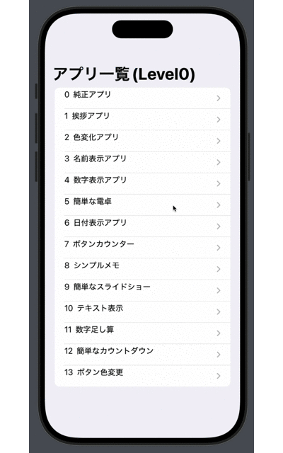
4. 簡単な電卓 (SimpleCalculator) 作成完了

</details>

## 日付表示アプリ (DateDisplayApp)

<details>

| No | アプリ名(日本語) | 物理名 | 難易度(10段階) | 所要時間(日数) | 機能 | おすすめポイント | その他必要なものや特記事項 |
|---|---|---|---|---|---|---|---|
| 6 | 日付表示アプリ | DateDisplayApp | 0 | 1h | 現在の日付を表示 | 日付と時間の取得方法を学べる | - |

1. DateDisplayApp.swiftの作成と実装
   ```swift

   ```
2. HomeView.swiftの実装
   1. AppInfo構造体のインスタンスを作成します。
   2. `AppInfo(title: "日付表示アプリ", destination: AnyView(DateDisplayApp())),`
3. 動作確認
   1. 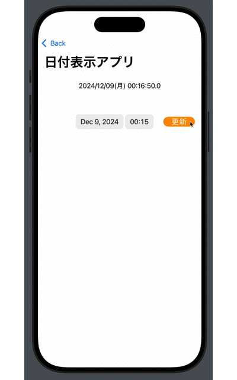
4. 日付表示アプリ (DateDisplayApp) 作成完了

</details>

## ボタンカウンター (ButtonCounterApp)

<details>

| No | アプリ名(日本語) | 物理名 | 難易度(10段階) | 所要時間(日数) | 機能 | おすすめポイント | その他必要なものや特記事項 |
|---|---|---|---|---|---|---|---|
| 7 | ボタンカウンター | ButtonCounterApp | 0 | 1h | ボタンを押すとカウントアップ | ボタンのイベント処理を学べる | - |

1. ButtonCounterApp.swiftの作成と実装
   ```swift

   ```
2. HomeView.swiftの実装
   1. AppInfo構造体のインスタンスを作成します。
   2. `AppInfo(title: "ボタンカウンター", destination: AnyView(ButtonCounterApp())),`
3. 動作確認
   1. 
4. ボタンカウンター (ButtonCounterApp) 作成完了

</details>

## 8. シンプルメモ (SimpleMemoApp)

<details>

| No | アプリ名(日本語) | 物理名 | 難易度(10段階) | 所要時間(日数) | 機能 | おすすめポイント | その他必要なものや特記事項 |
|---|---|---|---|---|---|---|---|
| 8 | シンプルメモ | SimpleMemoApp | 0 | 1h | メモを1つ保存 | 簡単な文字列の保存方法を学べる | UserDefaults利用 |

1. SimpleMemoApp.swiftの作成と実装
   ```swift

   ```
2. HomeView.swiftの実装
   1. AppInfo構造体のインスタンスを作成します。
   2. `AppInfo(title: "シンプルメモ", destination: AnyView(SimpleMemoApp())),`
3. 動作確認
   1. 
4. 8. シンプルメモ (SimpleMemoApp) 作成完了

</details>
